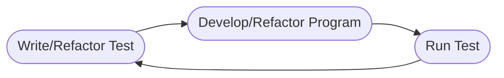

# Welcome to JS - TDD!

**Test-driven development(TDD)** is a coding practice where you write the result you want your program to produce before creating the program or it requires you to pre-specify the output your intended program must produce to past the test functioning the way you envisioned.
**TDD workflow:**

You can use some test running tools like Jasmine, Mocha, Tape and Jest.

## Let's use Jest as a Test Implementation Tool
Here are the steps you'll need to follow to get started using Jest as your Test implementation tool:
* Get the right Node and NPM version
* Create a project directory
* Navigate to your project folder
* Create a `package.json` file by `npm init -y`
* Install Jest `npm install jest --save-dev`
* Make Jest your project's test runner tool .. `{ "test" :"jest" }`
* Create your project file
* Create your test file with `.test.js`
* Write your test case
 *example:* 

> const function = require("./function");  
> test("condition", () = { 	
> expect(function(param)).toBe(result);  
> }

* Develop your program
* Run the test
* Refactor the test Code
* Rerun the test , **And that's It !**

# Some Other stuff to know about Using ES6 modules with Jest
Jest does not currently recognize ES6 modules. However, suppose you prefer to use ES6's import/export statements.

 1. Install babel as a development dependency
 2. Create a  `.babelrc` file in your project's root
 3. Open the `.babelrc` file and replicate the code below
 4. Rerun the test

# Advantages of TTD

 - Understand your program's purpose
 - Confidence booster
